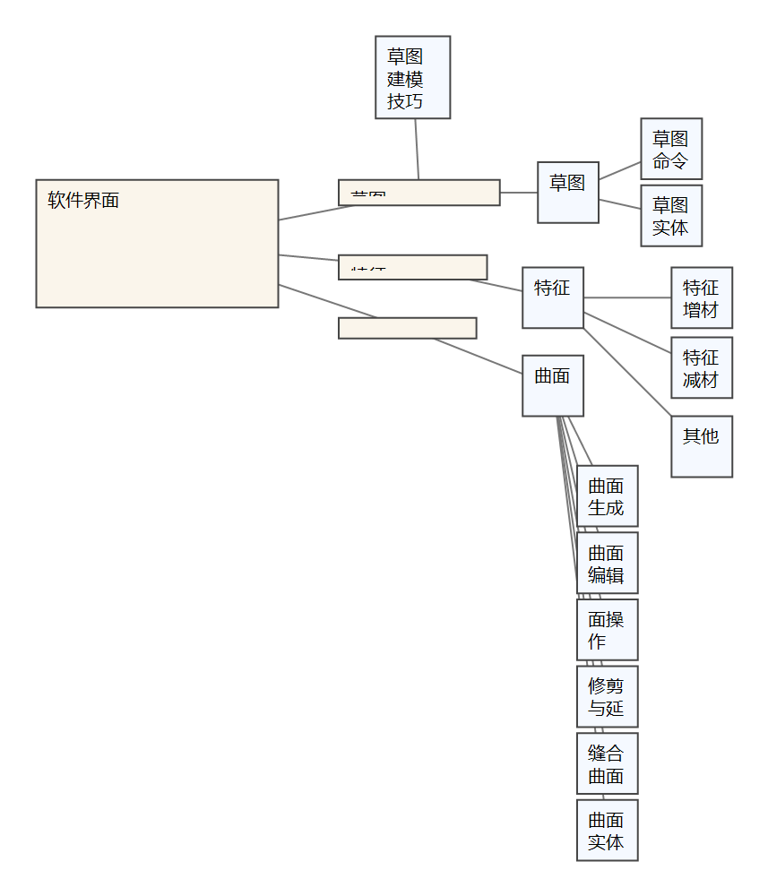

# Obsidian 学软件（方法 + 示例库）

[中文](README.md) | [English](README.en.md)

这个开源仓库分享一套**用 Obsidian 学习/记忆复杂软件**的方法，并提供可直接下载使用的**示例 Vault**（从 SolidWorks 开始，后续会持续增加）。

你本地可能会同时存在两类仓库（这是正常且推荐的）：

- **你的个人总仓库（私有）**：把你学习的所有软件/知识都放在同一个 Obsidian Vault 里（持续迭代、包含个人内容，不建议公开）。
- **这个开源示例仓库（公开）**：把“方法论 + 多个示例 Vault”开源出来，任何人可以按需只下载某一个示例来学习。

## 这个仓库想解决什么问题

很多软件（CAD/CAE、IDE、剪辑、渲染等）命令多、UI 复杂。单纯靠图谱插件随机布局或文件夹无限下钻，容易：

- 结构不直观，复习路径漂移
- 命令清单太长，难记难用
- 学到的技巧无法稳定归位，越记越乱

本方法对标的是：**自上而下**（先有 UI 地图，再下沉细节），并且**顺序稳定**（左→右，上→下），让结构能长期积累。

## 方法概览（最重要的约束）

- **Canvas 白板只做“视觉索引 + 顺序记忆”**：放截图与链接，不堆大段文字。
- **Markdown 只做“层级拆分 + 细节沉淀”**：上层页只做导航，下层页再写命令细节/参数/坑/技巧。
- **顺序必须稳定**：白板排布与索引清单都按“从左到右、从上到下”。
- **命令多就先分区再下钻**：先做“聚类索引页”（例如“曲面生成/曲面编辑”），再拆成叶子命令页。
- **截图需要手动完成**：先截图再放进 Vault；脚本主要帮你生成骨架、连线与整理图片。

详细说明见：`docs/方法论.md`

## 示例列表（按需下载）

每个示例都是一个独立 Obsidian Vault，位于 `examples/<name>_vault/`。

| 示例 | Vault 路径 | 入口文件 | 预览 |
|---|---|---|---|
| SolidWorks | `examples/solidworks_vault/` | `02-知识图谱/SolidWorks/白板思维导图.canvas` | `assets/solidworks-example.gif` |

### SolidWorks 示例预览

- 白板文件：`examples/solidworks_vault/02-知识图谱/SolidWorks/白板思维导图.canvas`
- 动图预览：`assets/solidworks-example.gif`（网页可直接显示）
- 原始视频：`assets/solidworks-example.mp4`（更清晰，但很多网页不内嵌播放）

白板图谱预览（点击图片播放视频）：

动图（网页内可直接看）：

## 如何打开示例（重要）

在 Obsidian 里把“示例 Vault 文件夹”当作一个独立 Vault 打开，例如：

- 打开 `examples/solidworks_vault/`

不要打开仓库根目录当 Vault（否则白板里的图片/链接会显示找不到）。

## 自动化脚本（可选）

- 生成 SolidWorks 曲面模块骨架并挂白板：`scripts/solidworks_surface_scaffold.ps1`
- 整理白板图片（移动到 `99-图片` + 单图项重命名）：`scripts/obsidian_canvas_organize_images.ps1`
- 导出你的私有仓库中的 SolidWorks 子集，生成开源示例 Vault：`scripts/export_solidworks_for_github.ps1`

使用方法见：`scripts/README.md`

## Skill（给 Codex 用）

- Skill 文件：`skills/obsidian-software-learning/SKILL.md`

## 计划：方法 + 多示例持续推进

这个仓库会持续增加更多软件示例（例如其它 CAD/CAE、IDE、剪辑软件等）。  
你也可以只下载你需要的那个示例 Vault，不必把所有示例都拉下来。
